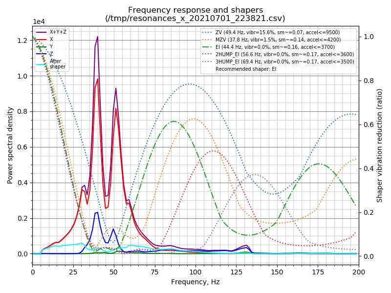

# Ender 3 - Micro-Swiss DDE and Triangle Labs 3:1 extruder motor


Standard Ender 3 with the following changes:
- BTT Ender Mini E3 Turbo board
- BLTouch for Z endstop
- 3 point bed level plate
- Micro-Swiss DDE
- Energetic Spring Steel Smooth PEI printing plate

## Mechanical Alignment

Used this video for (https://www.youtube.com/watch?v=4bFYH0X3qjk)[X-Gantry]

## Klipper firmware

The `make menuconfig` config file is located in this folder and is setup for the E3 Mini Turbo board.

### The new firmware update method

```shell
cd ~/klipper
sudo systemctl stop klipper
make
scripts/flash-sdcard.sh /dev/ttyACM0 btt-skr-e3-turbo
sudo systemctl start klipper
```

## Klipper printer.cfg

Upload the printer.cfg file to the Pi.

Restart the klipper software in the fluidd UI.

## Commissioning

### PID Tuning

* PID_CALIBRATE HEATER=extruder TARGET=170
* SAVE_CONFIG
* PID_CALIBRATE HEATER=heater_bed TARGET=60
* SAVE_CONFIG

### Bed Levelling

Start at the centre right wheel - as this installation has a 3-point bed

```gcode
BED_MESH_CLEAR
G28
G1 Z10
G1 X220 Y120.5 F6000
PROBE_ACCURACY
; Determine the z-height to adjust the wheels of the opposite two corners to aim for as an initial levelling
G1 X55 Y23 F6000
PROBE_ACCURACY
; Adjust the dial and repeat the PROBE_ACCURACY until the avg. is near the first probe point
G1 X55 Y218 F6000
PROBE_ACCURACY
SAVE_CONFIG
```

Repeat a final test and then run the BED_MESH_CALIBRATE

### Input Shaper

* Enable SPI in `sudo raspi-config`
* Remove the serial prefix with `vim /boot/comdline.txt`

Copy `.config-linux` as `.config` to the pi and compile

```shell
scp .config-linux pi@ender3:~/klipper/.config
ssh pi@ender3
cd ~/klipper
make clean
make
make flash
sudo cp "./scripts/klipper-mcu-start.sh" /etc/init.d/klipper_mcu
sudo update-rc.d klipper_mcu defaults
```

Add the mcu and resonance_tester sections to printer.cfg

```
[mcu rpi]
serial: /tmp/klipper_host_mcu

[adxl345]
cs_pin: rpi:None

[resonance_tester]
accel_chip: adxl345
probe_points:
    100,100,20  # an example
```

* ~/klippy-env/bin/pip install -v numpy
* sudo apt install python-numpy python-matplotlib

REBOOT

Test the mcu using the cli

```shell
gpioinfo|grep spi
	line   7:      unnamed   "spi0 CS1"  output   active-low [used]
	line   8:      unnamed   "spi0 CS0"  output   active-low [used]
```
Test the adxl345 via fluid interface

* G28
* ACCELEROMETER_QUERY
* MEASURE_AXES_NOISE

```text
ACCELEROMETER_QUERY
// adxl345 values (x, y, z): 305.967480, 382.459350, 9179.024400
MEASURE_AXES_NOISE
// Axes noise for xy-axis accelerometer: 19.791827 (x), 20.383743 (y), 54.123011 (z)
```

Set the accel values high

```
[printer]
max_accel: 7000
max_accel_to_decel: 7000
```
Disable input shaper and run the test
* SET_INPUT_SHAPER SHAPER_FREQ_X=0 SHAPER_FREQ_Y=0
* The above is ok to fail if you do not have a `[input_shaper]` section
* TEST_RESONANCES AXIS=X
* TEST_RESONANCES AXIS=Y

Generate the output
Change the timestamp as appropriate



X Shaper Result

```
~/klipper/scripts/calibrate_shaper.py /tmp/resonances_x_20210701_223821.csv -o /tmp/resonances_x_20210701_223821.png
Fitted shaper 'zv' frequency = 49.4 Hz (vibrations = 15.6%, smoothing ~= 0.069)
To avoid too much smoothing with 'zv', suggested max_accel <= 9500 mm/sec^2
Fitted shaper 'mzv' frequency = 37.8 Hz (vibrations = 1.5%, smoothing ~= 0.143)
To avoid too much smoothing with 'mzv', suggested max_accel <= 4200 mm/sec^2
Fitted shaper 'ei' frequency = 44.4 Hz (vibrations = 0.0%, smoothing ~= 0.163)
To avoid too much smoothing with 'ei', suggested max_accel <= 3700 mm/sec^2
Fitted shaper '2hump_ei' frequency = 56.6 Hz (vibrations = 0.0%, smoothing ~= 0.168)
To avoid too much smoothing with '2hump_ei', suggested max_accel <= 3600 mm/sec^2
Fitted shaper '3hump_ei' frequency = 69.4 Hz (vibrations = 0.0%, smoothing ~= 0.170)
To avoid too much smoothing with '3hump_ei', suggested max_accel <= 3500 mm/sec^2
Recommended shaper is ei @ 44.4 Hz
```


Y Shaper Result
```shell
pi@ender3:~ $ ~/klipper/scripts/calibrate_shaper.py /tmp/resonances_y_20210630_223910.csv -o /tmp/shaper_calibrate_y.png
Fitted shaper 'zv' frequency = 46.0 Hz (vibrations = 9.5%, smoothing ~= 0.078)
To avoid too much smoothing with 'zv', suggested max_accel <= 8200 mm/sec^2
Fitted shaper 'mzv' frequency = 29.4 Hz (vibrations = 1.0%, smoothing ~= 0.236)
To avoid too much smoothing with 'mzv', suggested max_accel <= 2500 mm/sec^2
Fitted shaper 'ei' frequency = 39.4 Hz (vibrations = 0.0%, smoothing ~= 0.208)
To avoid too much smoothing with 'ei', suggested max_accel <= 2900 mm/sec^2
Fitted shaper '2hump_ei' frequency = 50.2 Hz (vibrations = 0.0%, smoothing ~= 0.214)
To avoid too much smoothing with '2hump_ei', suggested max_accel <= 2800 mm/sec^2
Fitted shaper '3hump_ei' frequency = 62.0 Hz (vibrations = 0.0%, smoothing ~= 0.213)
To avoid too much smoothing with '3hump_ei', suggested max_accel <= 2800 mm/sec^2
Recommended shaper is ei @ 39.4 Hz

# Tightented the Y-Axis belt and re-run the test

pi@ender3:~ $ ~/klipper/scripts/calibrate_shaper.py /tmp/resonances_y_20210630_230110.csv -o /tmp/shaper_calibrate_y.png
Fitted shaper 'zv' frequency = 48.2 Hz (vibrations = 2.8%, smoothing ~= 0.072)
To avoid too much smoothing with 'zv', suggested max_accel <= 9100 mm/sec^2
Fitted shaper 'mzv' frequency = 46.2 Hz (vibrations = 0.0%, smoothing ~= 0.095)
To avoid too much smoothing with 'mzv', suggested max_accel <= 6300 mm/sec^2
Fitted shaper 'ei' frequency = 56.2 Hz (vibrations = 0.0%, smoothing ~= 0.102)
To avoid too much smoothing with 'ei', suggested max_accel <= 5900 mm/sec^2
Fitted shaper '2hump_ei' frequency = 71.6 Hz (vibrations = 0.0%, smoothing ~= 0.105)
To avoid too much smoothing with '2hump_ei', suggested max_accel <= 5700 mm/sec^2
Fitted shaper '3hump_ei' frequency = 88.0 Hz (vibrations = 0.0%, smoothing ~= 0.106)
To avoid too much smoothing with '3hump_ei', suggested max_accel <= 5700 mm/sec^2
Recommended shaper is mzv @ 46.2 Hz
```

Set the `[input_shaper]` from the above outputs

```
[input_shaper]
shaper_freq_x: 52.4
shaper_type_x: 2hump_ei
shaper_freq_y: 46.2
shaper_type_y: mzv
```

Print the ringing_tower.stl to confirm that you have good settings.

Vase mode 6 base layers bottom 0.25mm height at 100 mm/s on all perimeters. 0.95 flow with the set rotation_distance is on point with 0.4mm wall width.


SET_PRESSURE_ADVANCE ADVANCE=0
; disable t
SET_INPUT_SHAPER SHAPER_FREQ_X=0 SHAPER_FREQ_Y=0
TUNING_TOWER COMMAND=SET_VELOCITY_LIMIT PARAMETER=ACCEL START=1250 FACTOR=100 BAND=5
; RESTART
; Print with input_shaper set
TUNING_TOWER COMMAND=SET_VELOCITY_LIMIT PARAMETER=ACCEL START=1250 FACTOR=100 BAND=5

The difference between resonance disabled and enabled is mind boggling. The quality is at another level. Ringing is all but banished. Lovely square corners too.

### Pressure Advance

Read the [docs](https://www.klipper3d.org/Pressure_Advance.html) on github.

```
SET_PRESSURE_ADVANCE ADVANCE=0
SET_VELOCITY_LIMIT SQUARE_CORNER_VELOCITY=1 ACCEL=500
TUNING_TOWER COMMAND=SET_PRESSURE_ADVANCE PARAMETER=ADVANCE START=0 FACTOR=.005
```

#### Print the test file
calibration/CE3_square_tower.gcode

Calculated result was

```text
pressure_advance: 0.07500
```
