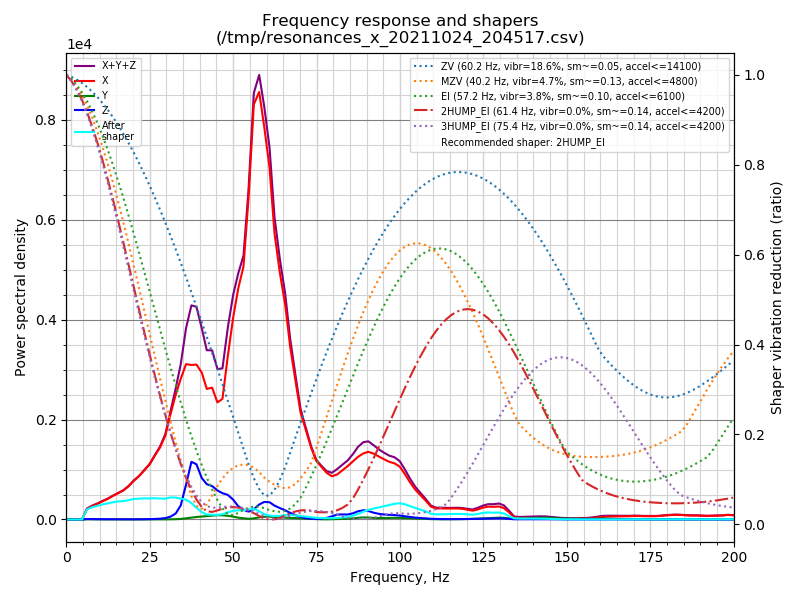
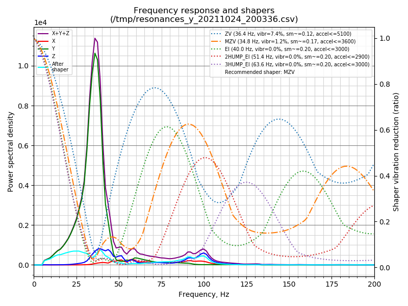

# Switchwire

SKR1.3 board with TMC2209 drivers
Raspberry Pi 3B
fluiddpi image and interface
klipper 0.10.x
24v 50W TL heater
Dragon SF Hotend
LDO motor and bed kit
Robotdigg Rails
Fiberlogy ABS+ parts printed on the Prusa Mini
Rexroth Frame
Meanwell LRS 200 and 25 PSUs
FYSECT Mini 12864 display

## fysetc lcd reminder

[fysetc mini 12864 display](https://wiki.fysetc.com/Manual_for_Mini_panel_on_SKR/) needs to be fixed.

To get the display to work you need to reverse one side of the connectors. Easiest option is to lift both black plastic ribbon cable holders with the keyed slot on the rear side of the display with a small screwdriver upwards by wiggling and lifting slowly at both sides. Once the holder is off turn it 180 degrees and relocate by carefully pressing downwards. Do this for Exp1 and Exp2. Enjoy the new display and functions.

Covers flipped on the screen and the wires were crossed - LCD is now working

## DONE

* STEPPER_BUZZ for x, y and z - successful
* Fixed direction pins for x, y and z motors
* Tested X and Y endstops
* G28 Y is successful
* Z probe is now working and tested
* Part fan is connected and operational
* flipped the EXP connectors on the LCD display, but it is still dead - wires were swapped - now working
* [rack](https://discordapp.com/channels/460117602945990666/741806179247980695/896720699455049738) the gantry to the bed
* tighten X and Z belts
* check y belt tension
* PID tune heater and bed
* Check fan connection - Hotend Cooling
* z offset

## flashing

```console
cd ~/klipper
sudo systemctl stop klipper
./scripts/flash-sdcard.sh /dev/ttyACM0 btt-skr-v1.3
sudo systemctl start klipper
```

## Fixed

### SKR 1.3 usb port missing

`dmesg` output of the badflash that resulted in the USB port to the SKR becoming unavailable.
Why? `CONFIG_FLASH_START` address changed due to de-selecting `CONFIG_SMOOTHIEWARE_BOOTLOADER` and flash the bad image to the board.

```text
# failure of USB port on SKR1.3 after running STEPPER_BUZZ on 3 motors

[ 1227.975228] WARN::dwc_otg_hcd_urb_dequeue:639: Timed out waiting for FSM NP transfer to complete on 3

[ 1228.326073] WARN::dwc_otg_hcd_urb_dequeue:639: Timed out waiting for FSM NP transfer to complete on 7

[ 1231.128476] WARN::dwc_otg_hcd_urb_dequeue:639: Timed out waiting for FSM NP transfer to complete on 6
[ 1240.099916] usb 1-1.3: USB disconnect, device number 6
```

* Formatted the SD-CARD to FAT32 for good measure.
* Need to reset the board button twice for the new FIRMWARE.BIN to be written to flash. 

### Probe issue

No RED LED light on the probe. Negative wire came out of the connector. Moved the negative wire from the fan pin to the Z max negative pin. As per the this [video](https://youtu.be/c7cVv9qbSMw?t=145)
Probe speed - set to 5 gives more consistent results than a speed of 10.

## Improvements

### todo 

Install the gcode shell command extra [code](https://raw.githubusercontent.com/th33xitus/kiauh/master/resources/gcode_shell_command.py) and create a [script](https://raw.githubusercontent.com/th33xitus/kiauh/master/resources/autocommit.sh) to auto-commit changes. 

```

```
Print tuning [guide](https://github.com/AndrewEllis93/Print-Tuning-Guide) which I have forked for updates for Switchwire. Has Slicer settings too.

### linked github repo to klipper configs

I keep my configs and notes in github. Linking the printer config to the folder used by klipper simplifies when changes are made and it is then easier to commit and push the changes i.s.o. copying files around.

```bash
cd ~
mv klipper_config .klipper_config
ln -sf dev/klipper-configs/switchwire klipper_config
```

## Commissioning

### PID Tuning

* PID_CALIBRATE HEATER=extruder TARGET=170
* SAVE_CONFIG
* PID_CALIBRATE HEATER=heater_bed TARGET=60
* SAVE_CONFIG

### Probe 

* PROBE_ACCURACY
* PROBE_CALIBRATE

### z probe offset

If you adjust your z_offset to get the right squish, use `Z_OFFSET_APPLY_PROBE` that will apply your new offset to your probe's z_offset. No manual calculation and getting it wrong.

### input shaper

ACCELEROMETER_QUERY
TEST_RESONANCE AXIS=X

```text
 ~/klipper/scripts/calibrate_shaper.py /tmp/resonances_x_20211024_204517.csv -o /tmp/shaper_x.png
Fitted shaper 'zv' frequency = 60.2 Hz (vibrations = 18.6%, smoothing ~= 0.049)
To avoid too much smoothing with 'zv', suggested max_accel <= 14100 mm/sec^2
Fitted shaper 'mzv' frequency = 40.2 Hz (vibrations = 4.7%, smoothing ~= 0.126)
To avoid too much smoothing with 'mzv', suggested max_accel <= 4800 mm/sec^2
Fitted shaper 'ei' frequency = 57.2 Hz (vibrations = 3.8%, smoothing ~= 0.098)
To avoid too much smoothing with 'ei', suggested max_accel <= 6100 mm/sec^2
Fitted shaper '2hump_ei' frequency = 61.4 Hz (vibrations = 0.0%, smoothing ~= 0.143)
To avoid too much smoothing with '2hump_ei', suggested max_accel <= 4200 mm/sec^2
Fitted shaper '3hump_ei' frequency = 75.4 Hz (vibrations = 0.0%, smoothing ~= 0.144)
To avoid too much smoothing with '3hump_ei', suggested max_accel <= 4200 mm/sec^2
Recommended shaper is 2hump_ei @ 61.4 Hz
```

Input shaper X result 


TEST_RESONANCE AXIS=Y

```text
 ~/klipper/scripts/calibrate_shaper.py  /tmp/resonances_y_20211024_200336.csv -o /tmp/shaper_y.png
Fitted shaper 'zv' frequency = 36.4 Hz (vibrations = 7.4%, smoothing ~= 0.119)
To avoid too much smoothing with 'zv', suggested max_accel <= 5100 mm/sec^2
Fitted shaper 'mzv' frequency = 34.8 Hz (vibrations = 1.2%, smoothing ~= 0.168)
To avoid too much smoothing with 'mzv', suggested max_accel <= 3600 mm/sec^2
Fitted shaper 'ei' frequency = 40.0 Hz (vibrations = 0.0%, smoothing ~= 0.201)
To avoid too much smoothing with 'ei', suggested max_accel <= 3000 mm/sec^2
Fitted shaper '2hump_ei' frequency = 51.4 Hz (vibrations = 0.0%, smoothing ~= 0.204)
To avoid too much smoothing with '2hump_ei', suggested max_accel <= 2900 mm/sec^2
Fitted shaper '3hump_ei' frequency = 63.6 Hz (vibrations = 0.0%, smoothing ~= 0.203)
To avoid too much smoothing with '3hump_ei', suggested max_accel <= 3000 mm/sec^2
Recommended shaper is mzv @ 34.8 Hz
```

Input shaper Y result 
