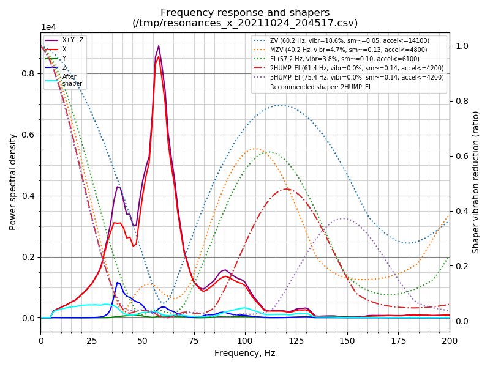
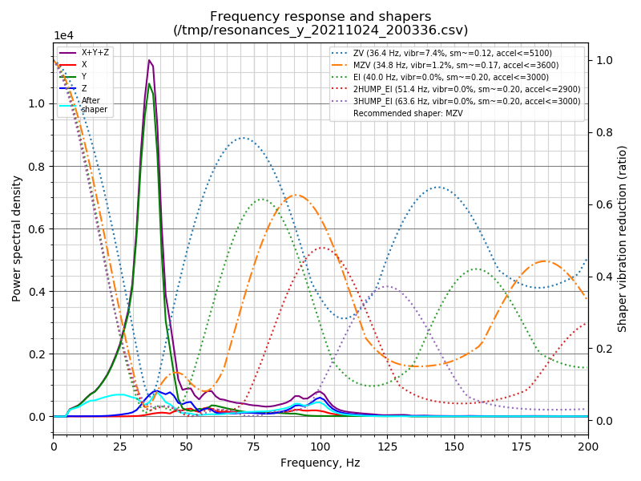

# Switchwire

SKR1.3 board with TMC2209 drivers
Raspberry Pi 3B
fluiddpi image and interface
klipper 0.10.x
24v 50W TL heater
Dragon SF Hotend
LDO motor and bed kit
Robotdigg Rails
Fiberlogy ABS+ parts printed on the Prusa Mini
Rexroth Frame
Meanwell LRS 200 and 25 PSUs
FYSECT Mini 12864 display

## fysetc lcd reminder

[fysetc mini 12864 display](https://wiki.fysetc.com/Manual_for_Mini_panel_on_SKR/) needs to be fixed.

To get the display to work you need to reverse one side of the connectors. Easiest option is to lift both black plastic ribbon cable holders with the keyed slot on the rear side of the display with a small screwdriver upwards by wiggling and lifting slowly at both sides. Once the holder is off turn it 180 degrees and relocate by carefully pressing downwards. Do this for Exp1 and Exp2. Enjoy the new display and functions.

Covers flipped on the screen and the wires were crossed - LCD is now working

## DONE

* STEPPER_BUZZ for x, y and z - successful
* Fixed direction pins for x, y and z motors
* Tested X and Y endstops
* G28 Y is successful
* Z probe is now working and tested
* Part fan is connected and operational
* flipped the EXP connectors on the LCD display, but it is still dead - wires were swapped - now working
* [rack](https://discordapp.com/channels/460117602945990666/741806179247980695/896720699455049738) the gantry to the bed
* tighten X and Z belts
* check y belt tension
* PID tune heater and bed
* Check fan connection - Hotend Cooling
* z offset

## flashing

```console
cd ~/klipper
sudo systemctl stop klipper
./scripts/flash-sdcard.sh $(ls /dev/serial/by-id/*lpc1768*) btt-skr-v1.3
sudo systemctl start klipper
```

## Fixed

### SKR 1.3 usb port missing

`dmesg` output of the badflash that resulted in the USB port to the SKR becoming unavailable.
Why? `CONFIG_FLASH_START` address changed due to de-selecting `CONFIG_SMOOTHIEWARE_BOOTLOADER` and flash the bad image to the board.

```text
# failure of USB port on SKR1.3 after running STEPPER_BUZZ on 3 motors

[ 1227.975228] WARN::dwc_otg_hcd_urb_dequeue:639: Timed out waiting for FSM NP transfer to complete on 3

[ 1228.326073] WARN::dwc_otg_hcd_urb_dequeue:639: Timed out waiting for FSM NP transfer to complete on 7

[ 1231.128476] WARN::dwc_otg_hcd_urb_dequeue:639: Timed out waiting for FSM NP transfer to complete on 6
[ 1240.099916] usb 1-1.3: USB disconnect, device number 6
```

* Formatted the SD-CARD to FAT32 for good measure.
* Need to reset the board button twice for the new FIRMWARE.BIN to be written to flash.

### Probe issue

No RED LED light on the probe. Negative wire came out of the connector. Moved the negative wire from the fan pin to the Z max negative pin. As per the this [video](https://youtu.be/c7cVv9qbSMw?t=145)
Probe speed - set to 5 gives more consistent results than a speed of 10.

## Improvements

### todo

Install the gcode shell command extra [code](https://raw.githubusercontent.com/th33xitus/kiauh/master/resources/gcode_shell_command.py) and create a [script](https://raw.githubusercontent.com/th33xitus/kiauh/master/resources/autocommit.sh) to auto-commit changes.

```

```
Print tuning [guide](https://github.com/AndrewEllis93/Print-Tuning-Guide) which I have forked for updates for Switchwire. Has Slicer settings too.

### linked github repo to klipper configs

I keep my configs and notes in github. Linking the printer config to the folder used by klipper simplifies when changes are made and it is then easier to commit and push the changes i.s.o. copying files around.

```bash
cd ~
mv klipper_config .klipper_config
ln -sf dev/klipper-configs/switchwire klipper_config
```

## Commissioning

### PID Tuning

* PID_CALIBRATE HEATER=extruder TARGET=170
* SAVE_CONFIG
* PID_CALIBRATE HEATER=heater_bed TARGET=60
* SAVE_CONFIG

### Probe

* PROBE_ACCURACY
* PROBE_CALIBRATE

### z probe offset

If you adjust your z_offset to get the right squish, use `Z_OFFSET_APPLY_PROBE` that will apply your new offset to your probe's z_offset. No manual calculation and getting it wrong.

### input shaper

ACCELEROMETER_QUERY
TEST_RESONANCE AXIS=X

```text
 ~/klipper/scripts/calibrate_shaper.py /tmp/resonances_x_20211024_204517.csv -o /tmp/shaper_x.png
Fitted shaper 'zv' frequency = 60.2 Hz (vibrations = 18.6%, smoothing ~= 0.049)
To avoid too much smoothing with 'zv', suggested max_accel <= 14100 mm/sec^2
Fitted shaper 'mzv' frequency = 40.2 Hz (vibrations = 4.7%, smoothing ~= 0.126)
To avoid too much smoothing with 'mzv', suggested max_accel <= 4800 mm/sec^2
Fitted shaper 'ei' frequency = 57.2 Hz (vibrations = 3.8%, smoothing ~= 0.098)
To avoid too much smoothing with 'ei', suggested max_accel <= 6100 mm/sec^2
Fitted shaper '2hump_ei' frequency = 61.4 Hz (vibrations = 0.0%, smoothing ~= 0.143)
To avoid too much smoothing with '2hump_ei', suggested max_accel <= 4200 mm/sec^2
Fitted shaper '3hump_ei' frequency = 75.4 Hz (vibrations = 0.0%, smoothing ~= 0.144)
To avoid too much smoothing with '3hump_ei', suggested max_accel <= 4200 mm/sec^2
Recommended shaper is 2hump_ei @ 61.4 Hz
```

Input shaper X result 


TEST_RESONANCE AXIS=Y

```text
 ~/klipper/scripts/calibrate_shaper.py  /tmp/resonances_y_20211024_200336.csv -o /tmp/shaper_y.png
Fitted shaper 'zv' frequency = 36.4 Hz (vibrations = 7.4%, smoothing ~= 0.119)
To avoid too much smoothing with 'zv', suggested max_accel <= 5100 mm/sec^2
Fitted shaper 'mzv' frequency = 34.8 Hz (vibrations = 1.2%, smoothing ~= 0.168)
To avoid too much smoothing with 'mzv', suggested max_accel <= 3600 mm/sec^2
Fitted shaper 'ei' frequency = 40.0 Hz (vibrations = 0.0%, smoothing ~= 0.201)
To avoid too much smoothing with 'ei', suggested max_accel <= 3000 mm/sec^2
Fitted shaper '2hump_ei' frequency = 51.4 Hz (vibrations = 0.0%, smoothing ~= 0.204)
To avoid too much smoothing with '2hump_ei', suggested max_accel <= 2900 mm/sec^2
Fitted shaper '3hump_ei' frequency = 63.6 Hz (vibrations = 0.0%, smoothing ~= 0.203)
To avoid too much smoothing with '3hump_ei', suggested max_accel <= 3000 mm/sec^2
Recommended shaper is mzv @ 34.8 Hz
```

Input shaper Y result 

### klipper expander

https://github.com/VoronDesign/Voron-Hardware/blob/master/Klipper_Expander/Documentation/Setup_and_Flashing_Guide.md

Add the boot jumper. Reset the board. Confirm that the board is in dfu-util mode

```console
dfu-util --list
sudo systemctl stop klipper
cd ~/klipper
make clean
cp ~/dev/klipper-configs/.config-expander ~/klipper/.config
make -j4
make flash FLASH_DEVICE=0483:df11
# remove boot jumper
# reset the board
sudo systemctl start klipper
```

### mellow fly usb adxl bed with rp2040

Press the boot button and then power it up via the usb cable

```console
sudo systemctl stop klipper
cd ~/klipper
make clean
cp ~/dev/klipper-configs/.config-bed ~/klipper/.config
make -j4
make flash FLASH_DEVICE=2e8a:0003 # reboots the chip

sudo systemctl stop klipper
```

### klippain shaketune

```text
CREATE_VIBRATIONS_PROFILE
....
19:38:54 // Machine estimated vibration symmetry: 39.0%
19:38:54 // Vibrations peaks detected: 3 @ 87.3, 129.9, 165.3 mm/s (avoid setting a speed near these values in your slicer print profile)
19:38:54 // Lowest vibrations speeds (3 ranges sorted from best to worse):
19:38:54 // 1: 2.0 to 80.0 mm/s
19:38:54 // 2: 145.8 to 155.4 mm/s
19:38:54 // 3: 196.0 to 200.0 mm/s
19:38:54 // Lowest vibrations angles (2 ranges sorted from best to worse):
19:38:54 // 1: 65.6° to 114.7° (mean vibrations energy: 19.81% of max)
19:38:54 // 2: 245.8° to 294.9° (mean vibrations energy: 19.81% of max)
19:38:57 // Motors have a main resonant frequency at 210.4Hz with an estimated damping ratio of 0.069
19:39:35 // vibrations profile graphs created successfully!

AXES_SHAPER_CALIBRATION
....
// Shake&Tune version: v4.1.0-1-g66f5e32
19:42:13 // X axis frequency profile generation...
19:42:13 // This may take some time (1-3min)
19:42:18 // Fitted shaper 'zv' frequency = 57.6 Hz (vibrations = 6.2%, smoothing ~= 0.062)
19:42:18 // To avoid too much smoothing with 'zv', suggested max_accel <= 12700 mm/sec^2
19:42:21 // Fitted shaper 'mzv' frequency = 54.8 Hz (vibrations = 0.5%, smoothing ~= 0.075)
19:42:21 // To avoid too much smoothing with 'mzv', suggested max_accel <= 8800 mm/sec^2
19:42:24 // Fitted shaper 'ei' frequency = 64.6 Hz (vibrations = 0.0%, smoothing ~= 0.082)
19:42:24 // To avoid too much smoothing with 'ei', suggested max_accel <= 7800 mm/sec^2
19:42:27 // Fitted shaper '2hump_ei' frequency = 81.0 Hz (vibrations = 0.0%, smoothing ~= 0.091)
19:42:27 // To avoid too much smoothing with '2hump_ei', suggested max_accel <= 7300 mm/sec^2
19:42:30 // Fitted shaper '3hump_ei' frequency = 98.4 Hz (vibrations = 0.0%, smoothing ~= 0.093)
19:42:30 // To avoid too much smoothing with '3hump_ei', suggested max_accel <= 7000 mm/sec^2
19:42:30 // -> Recommended shaper is MZV @ 54.8 Hz (when using a square corner velocity of 8.0 and a damping ratio of 0.098)
19:42:31 // Peaks detected on the graph: 1 @ 56.9 Hz (1 above effect threshold)


// Y axis frequency profile generation...
19:44:54
// This may take some time (1-3min)
19:44:58
// Fitted shaper 'zv' frequency = 41.0 Hz (vibrations = 5.9%, smoothing ~= 0.105)
19:44:58
// To avoid too much smoothing with 'zv', suggested max_accel <= 6100 mm/sec^2
19:45:02
// Fitted shaper 'mzv' frequency = 40.0 Hz (vibrations = 1.0%, smoothing ~= 0.128)
19:45:02
// To avoid too much smoothing with 'mzv', suggested max_accel <= 4700 mm/sec^2
19:45:05
// Fitted shaper 'ei' frequency = 48.2 Hz (vibrations = 0.0%, smoothing ~= 0.141)
19:45:05
// To avoid too much smoothing with 'ei', suggested max_accel <= 4300 mm/sec^2
19:45:08
// Fitted shaper '2hump_ei' frequency = 62.6 Hz (vibrations = 0.0%, smoothing ~= 0.141)
19:45:08
// To avoid too much smoothing with '2hump_ei', suggested max_accel <= 4000 mm/sec^2
19:45:11
// Fitted shaper '3hump_ei' frequency = 77.8 Hz (vibrations = 0.0%, smoothing ~= 0.140)
19:45:11
// To avoid too much smoothing with '3hump_ei', suggested max_accel <= 4100 mm/sec^2
19:45:11
// -> Recommended shaper is MZV @ 40.0 Hz (when using a square corner velocity of 8.0 and a damping ratio of 0.049)
19:45:12
// Peaks detected on the graph: 1 @ 39.6 Hz (1 above effect threshold)
19:45:17
// input shaper graphs created successfully!


## overhauling october 2024

* [PiCAN](https://github.com/xbst/PiCAN) adapter
* SB2209 CAN with the GH1.5 connectors :scream:
* Sensorless on X
* No magnet MK52 heat bed and magnet foil bed sheet for the PEI plates for Eddy USB
* Modded X, Z gantry, frame and stepper printed parts
* 0.5mm shim between bearing stacks for additional belt with. Belts are 6mm with a 10% size tolerance
* Galileo2 extruder

### overhaul todo

* [fan monitoring](9https://ellis3dp.com/Print-Tuning-Guide/articles/useful_macros/hotend_fan_monitoring.html)

### extruder PID values

PLA PID values: PID_CALIBRATE HEATER=extruder TARGET=200
PID parameters for 200.00°C: pid_Kp=12.398 pid_Ki=0.566 pid_Kd=67.877

TPU PID values: PID_CALIBRATE HEATER=extruder TARGET=220
PID parameters for 220.00°C: pid_Kp=12.819 pid_Ki=0.609 pid_Kd=67.459

LW-PLA PID values: PID_CALIBRATE HEATER=extruder TARGET=240
PID parameters for 240.00°C: pid_Kp=12.740 pid_Ki=0.604 pid_Kd=67.122

PETG PID values: 

### bed PID values

PID parameters for 55.00°C: pid_Kp=29.089 pid_Ki=0.226 pid_Kd=936.652

## pi settings

TTC - change the Pi 3B+ changed force_turbo=1 to avoid TTC errors.

| Metric | Before | After |
|---|---|---|
| `governor` | `ondemand` | `ondemand` |
| `scaling_cur_freq` | `600000` (600 MHz) | `1200000` (1200 MHz) |
| `vcgencmd arm` | `600 MHz` | `1200 MHz` |
| `force_turbo` | `0` | `1` |


## eddy-ng

[eddy-ng](https://github.com/vvuk/eddy-ng) replaces the stock `probe_eddy_current` module with improved Z-offset handling via physical tap calibration. Installed as a Kalico plugin from `~/eddy-ng`.

### install / update

```bash
cd ~/eddy-ng
git pull
./install.sh
```

### firmware

The eddy MCU firmware must be rebuilt with eddy-ng enabled. The klipperfleet profile `eddy.config` includes `CONFIG_WANT_EDDY_NG=y`. Flash via KlipperFleet UI. The eddy fleet entry must have `is_katapult: false` since it uses USB bootloader request, not Katapult.

### config

Uses `[probe_eddy_ng btt_eddy]` with `sensor_type: btt_eddy` in `eddy.cfg` instead of `[probe_eddy_current btt_eddy]`. The `[temperature_probe]` section is replaced by a standard `[temperature_sensor]`.

### calibration

```
PROBE_EDDY_NG_SETUP          # automatic calibration (heat bed to 50-60C first)
PROBE_EDDY_NG_PROBE_STATIC   # verify readings (shorthand: PEPS)
PROBE_EDDY_NG_PROBE_ACCURACY # confirm probe accuracy
SAVE_CONFIG
```

### notes

- Kalico does NOT support `METHOD=rapid_scan` -- use `METHOD=automatic` or omit METHOD
- `horizontal_move_z: 2` in `[bed_mesh]` is correct for eddy probes
- Moonraker update manager entry added for automatic updates

## flashing SKR 1.3 via gcode

The `FLASH_SKR13` gcode command can flash the LPC1768 MCU from the Klipper console or Fluidd. It auto-detects the device via `/dev/serial/by-id/*lpc1768*`, builds firmware using the klipperfleet profile, and flashes via `flash-sdcard.sh`. Klipper stops and restarts automatically — do not run during a print.
