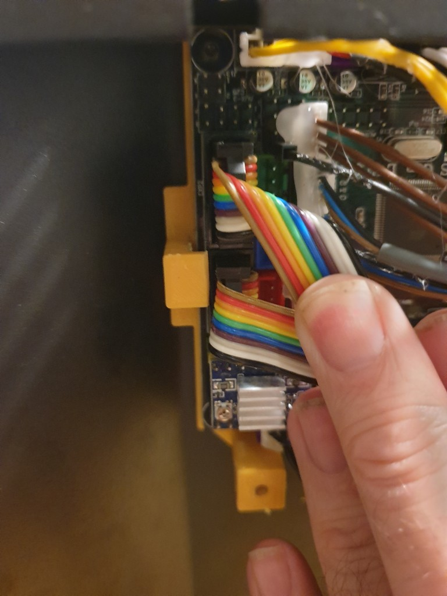
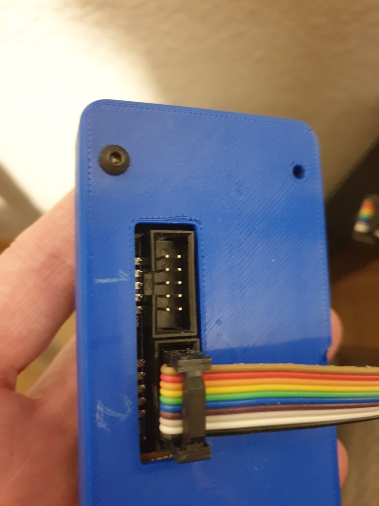
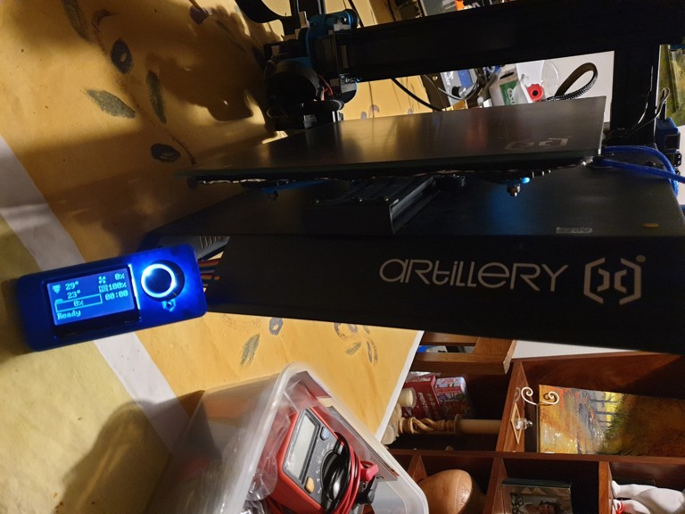

# Artillery Sidewinder - SWX1

Makerbase RAMPS [Gen_L V2.1](https://github.com/makerbase-mks/MKS-GEN_L) board

## Flashing klipper

Flash the firmware without any changes to the hardware, since I have already removed the stock TFT screen.

Use the the following to flash klipper 

```shell
cd ~/klipper
sudo systemctl stop klipper
make
make flash FLASH_DEVICE=/dev/serial/by-id/usb-1a86_USB_Serial-if00-port0
sudo systemctl start klipper
```
## udev-rules

Auto-restart the klipper service if the USB plug is removed or the printer is power cycled with the pi still running. See the discussion on the issue [#835](https://github.com/KevinOConnor/klipper/issues/835) of the firmware.

Add the [99-klipper.rules](99-klipper.rules) file to `/etc/udev/rules.d` folder. Ensure that the idVendor and idProduct match the values from `lsusb`. Then you will need to reload udev rules using `sudo udevadm control --reload-rules` or reboot the pi.

## Fysetc Mini12864 LCD Screen

I have installed the v2.1 version of the screen. See the config for details.

The pin layouts and diagrams make no sense, but it works.

The RAMPS side of things.



The Fysetc Mini 12864 side. Both wires are connected. One removed to see the edge of the connector.



The LCD is alive with a nice BLUE hue from the below config!



```python
######################################################################
# Fysetc Mini 12864Panel v2.1 (with neopixel backlight leds)
######################################################################

[display]
lcd_type: uc1701
cs_pin: EXP1_3
a0_pin: EXP1_4
rst_pin: EXP1_5
contrast: 63
encoder_pins: ^EXP2_5, ^EXP2_3
click_pin: ^!EXP1_2

[output_pin beeper]
pin: EXP1_1

[neopixel fysetc_mini12864]
pin: EXP1_6
chain_count: 3
color_order: RGB
initial_RED: 0.4
initial_GREEN: 0.4
initial_BLUE: 0.4
```
