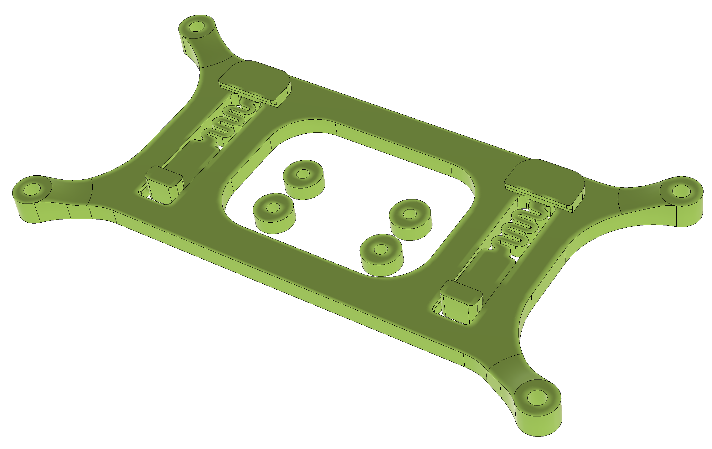

# Voron Research

[Voron Sourcing guide](https://vorondesign.com/sourcing_guide)
Download the individual pages to XLSX and then import into a Google Sheet based on the instructions from [here](https://tanaikech.github.io/2020/04/27/workaround-for-retrieving-direct-links-of-all-sheets-from-url-of-2pacx-of-web-published-google-spreadsheet/)
- 
- [Voron Jetpack](https://docs.google.com/spreadsheets/d/e/2PACX-1vS_jv9UtoSkgQoYD47VE9wIpTnjsEbzAREPG8895b6UL0v99OIfVEJQ4BHl2w_Rn6V0YUe1ldfPjone/pub?gid=987152919&output=xlsx)

Quick guide for installing/updating Klipper on the Spider:

Compiling:
- cd ~/klipper
- make menuconfig
  - select "Enable extra low-level configuration options"
  - select STM32 micro-controller architecture
  - select STM32F446 processor model
  - select 64KiB bootloader
  - select 12MHz crystal clock reference
  - if connected via UART: select "Serial (on USART1 PA10/PA9)" communication interface
- make clean
- make

Installing:
If your Spider is connected via USB or UART (requires an SDCard):
- copy compiled Klipper binary (/home/pi/klipper/out/klipper.bin) from the Pi onto a FAT-formatted SDCard
- rename Klipper binary from klipper.bin to firmware.bin
- insert SDCard into Spider
- power up the board and wait for a minute for the Flash LED (near SDCard slot) to stop blinking
- a successful flash can be verified afterwards by checking the SDCard for a file named OLD.BIN

Alternatively, if your Spider is connected via USB:
- put a jumper between the 3.3V and BT0 pin (located centrally on the board)
- power up board
- determine USB ID from lsusb (for example 1234:5678)
- make flash FLASH_DEVICE=1234:5678
- remove jumper from BT0 pin

Updating:
If an SDCard is inserted into the Spider:
- compile Klipper (see above)
- sudo service klipper stop
- ./scripts/flash-sdcard.sh /dev/<serial-device> fysetc-spider-v1 (where /dev/<serial-device> is either something like /dev/serial/by-id/<spider-serial-port> when connected via USB, or like /dev/ttyAMA0 when connected via UART)
- sudo service klipper start

Alternatively, if your Spider is connected via USB:
- compile Klipper (see above)
- sudo service klipper stop
- make flash FLASH_DEVICE=/dev/serial/by-id/<spider-serial-port>
- sudo service klipper start

Here is one more version of mount for Spider. Single piece 

You will need 4 heat inserts

[STL To print](Spider_Mount_DIN-Rail_slim.stl)

